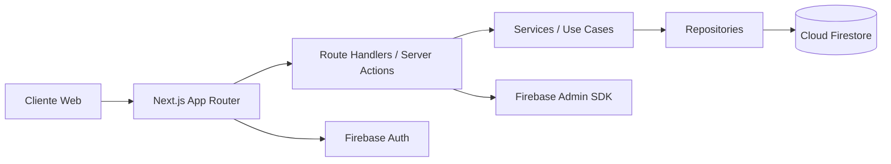

# FinCtrl v2

[](https://github.com/finctrl/finctrl/actions/workflows/ci.yml)
[](https://github.com/finctrl/finctrl/actions/workflows/coverage.yml)
[](https://vercel.com)

Aplicação web de controle financeiro pessoal com autenticação segura, isolamento por usuário e arquitetura escalável usando Next.js + Firebase.

## Status de consolidação

- A aplicação canônica está consolidada no App Router (`app/`).
- URLs legadas HTML (`/pages/*.html` e `/*.html`) são redirecionadas para rotas canônicas.
- O build web está restrito a páginas TypeScript (`.ts`/`.tsx`) para reduzir risco de regressão do legado.

## Stack

- Next.js 16 (App Router)
- TypeScript strict
- Tailwind CSS
- Firebase Auth + Firestore + Admin SDK
- React Hook Form + Zod
- Recharts
- Vitest + Playwright

## Screenshots / GIF do Dashboard

> Atualize os arquivos em `docs/assets/` quando tiver capturas reais do ambiente de produção.


## Architecture



### Camadas

- **UI (app/components/features):** renderização das páginas e componentes do dashboard.
- **Application (server/use-cases):** regras de negócio e orquestração dos fluxos.
- **Data (server/repositories):** acesso ao Firestore por contexto de usuário.
- **Infra (lib/firebase):** clientes Admin/Client, autenticação e App Check.

## Estrutura principal

```txt
app/
  (public)/
    landing/page.tsx
    login/page.tsx
  (app)/
    dashboard/page.tsx
    debts/page.tsx
    expenses/page.tsx
    goals/page.tsx
    fgts/page.tsx
    plan/page.tsx
    diagnostics/page.tsx
    settings/page.tsx
  api/
    auth/session/route.ts
    auth/logout/route.ts
    diagnostics/feedback/route.ts
    admin/health/route.ts
components/
features/
lib/firebase/
server/
types/
```

## Rotas canônicas

- Públicas: `/landing`, `/login`, `/releases`
- Privadas: `/dashboard`, `/expenses`, `/debts`, `/goals`, `/fgts`, `/plan`, `/diagnostics`, `/settings`, `/getting-started`

## Segurança adotada

- Session cookie `httpOnly` para sessão do Firebase Admin.
- Middleware protegendo rotas privadas.
- Validação de payload com Zod.
- Validação básica de App Check em endpoint sensível.
- Firestore Rules com isolamento por `request.auth.uid`.

## Rodando localmente

Requisito de runtime: Node `24.13.1` (ver `.nvmrc`).

No Windows PowerShell, prefira `npm.cmd` para evitar bloqueio por ExecutionPolicy.

```bash
npm.cmd ci
npm.cmd run dev
```

Para habilitar os hooks do Husky no clone local:

```bash
npm.cmd run prepare
```

## Scripts úteis

```bash
npm.cmd run lint
npm.cmd run typecheck
npm.cmd run test
npm.cmd run test:watch
npm.cmd run test:e2e
npm.cmd run test:e2e:smoke
npm.cmd run validate
npm.cmd run validate:local
```

## Loop local de validação

Use este ciclo curto para evoluir com segurança:

1. Desenvolvimento contínuo com `npm.cmd run test:watch`.
2. Antes de commit/push, rode `npm.cmd run validate`.
3. Para validar fluxo mínimo da aplicação, rode `npm.cmd run validate:local`.

Notas:

- `validate` roda lint + typecheck + testes unitários.
- `validate:local` roda `validate` e depois smoke e2e.
- O hook `pre-push` executa `npm run validate` automaticamente.

## Troubleshooting (Windows)

Se ocorrer erro de instalação parcial (`ENOTEMPTY`/`EPERM`) em `node_modules`:

```powershell
cmd /c rmdir /s /q node_modules
npm.cmd cache clean --force
npm.cmd ci
```

Se aparecer erro de script bloqueado (`npm.ps1`):

- Use `npm.cmd` em vez de `npm`.

## Releases semânticas

- Pipeline automatizado com **Release Please** (`.github/workflows/release.yml`).
- Tags com prefixo `v`, por exemplo: `v2.0.0`, `v2.1.0`.
- Histórico público em [`CHANGELOG.md`](./CHANGELOG.md).

## Preview por Pull Request

- Cada PR pode gerar um deploy temporário via Vercel (`.github/workflows/preview.yml`).
- O link do preview é publicado automaticamente nos comentários da PR.
- Secrets necessários: `VERCEL_TOKEN`, `VERCEL_ORG_ID`, `VERCEL_PROJECT_ID`.

## Roadmap sugerido

1. Migrar referências documentais restantes de `pages/*.html` para rotas canônicas do App Router.
2. Integrar Firebase Emulator Suite no fluxo local para testes determinísticos.
3. Expandir cobertura de testes (integração de repositórios + e2e autenticado).
4. Planejar remoção definitiva dos arquivos legados após janela de estabilização.
